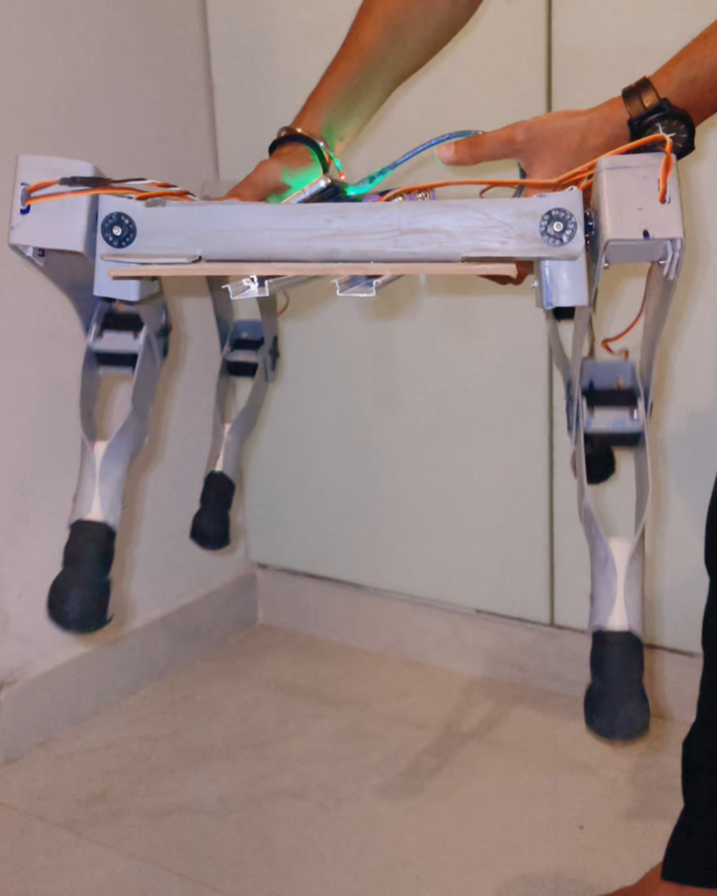
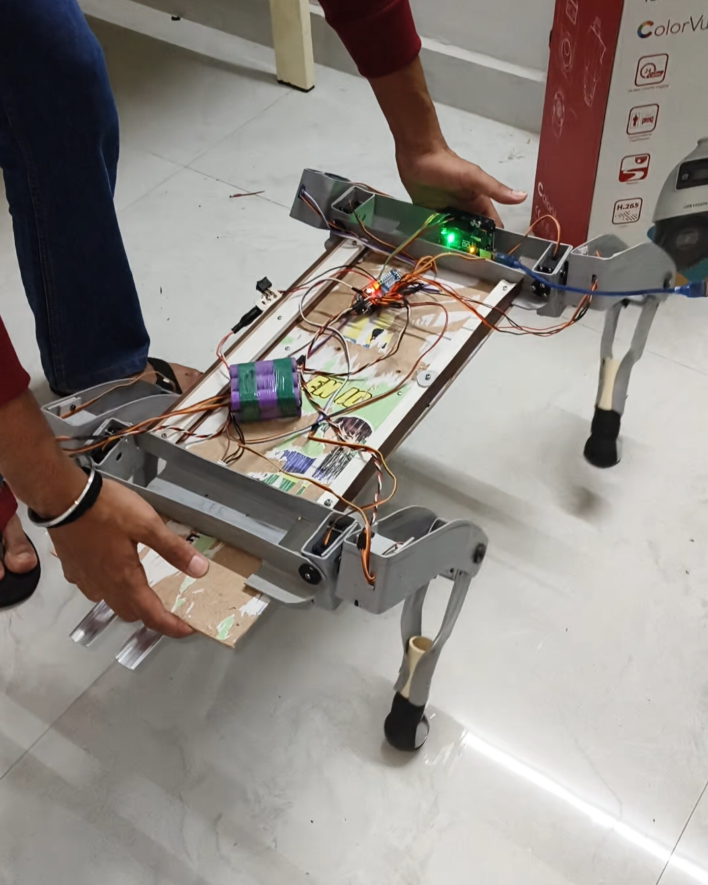
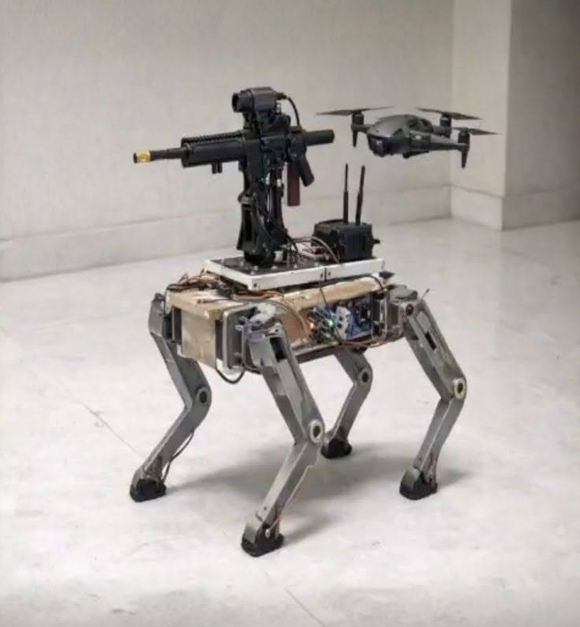

# Defense Quadruped Robot

> An Arduino-based autonomous quadruped robot inspired by future defense, surveillance, and rescue systems.

---

# Project Overview

This project is a 12-servo quadruped walking robot built using Arduino Uno and custom mechanical assembly.

The robot is designed to simulate stable four-legged locomotion while supporting future upgrades in autonomous navigation, drone communication, environmental sensing, and defense-oriented robotic applications.

Unlike software-only robotics simulations, the entire hardware structure of this robot was physically assembled manually, including:

- Servo motor mounting
- Chassis balancing
- Structural alignment
- Power wiring
- Leg mechanism integration
- Motion testing

---

# Robot Capabilities

- Forward walking
- Backward walking
- Left and right turning
- Rotational movement
- Stable quadruped stance
- Modular hardware architecture

---

# Hardware Components

| Component | Quantity |
|---|---|
| Arduino Uno | 1 |
| Servo Motors | 12 |
| Servo Driver Module | 1 |
| Battery Pack | 1 |
| Custom Chassis Frame | 1 |

---

# Robot Gallery

## Front View



---

## Stand Pose



---

## Future Vision Blueprint



---

# Folder Structure

```bash
Defense-Quadruped-Robot/
│
├── arduino_code/
├── images/
├── docs/
├── circuit_diagram/
├── videos/
└── README.md


---

# Research Inspiration

This project is inspired by real-world challenges in:

- Defence surveillance systems
- Search and rescue operations
- Autonomous unmanned ground vehicles
- Hazardous environment inspection
- Smart robotic assistance systems

The objective of this project is not just building a walking robot, but exploring how low-cost robotics platforms can evolve into intelligent autonomous systems capable of assisting in difficult and high-risk environments.

This quadruped robot is being developed as a hands-on independent research prototype focused on:

- Learning by building
- Mechanical robotics design
- Embedded systems integration
- Autonomous locomotion
- Future AI-based robotic systems

---

# Development Approach

Unlike simulation-only projects, this robot was physically designed and assembled from scratch using practical low-cost engineering methods and modular hardware architecture.

The project currently focuses on:

- Mechanical structure development
- Stable locomotion testing
- Servo coordination
- Hardware balancing
- Motion control experimentation

Future versions are planned to support:

- ROS 2 integration
- Raspberry Pi onboard computing
- Computer vision
- Sensor fusion
- Drone communication systems
- Autonomous navigation
- Defence-oriented surveillance applications

---


# Mechanical Design Contribution — Aman Sharma

- Designed the complete quadruped body architecture from scratch
- Planned body proportions, structure geometry, and load distribution
- Built the framework using low-cost materials and practical fabrication methods
- Performed chassis assembly, structural balancing, and leg alignment
- Designed the structure while keeping future upgrades and onboard systems in mind
- Ensured stability for locomotion and testing

---

# Project Philosophy

This is a self-initiated robotics research prototype created for learning, experimentation, and innovation through practical implementation instead of ready-made solutions.

The long-term vision is to contribute toward future intelligent robotic systems capable of supporting surveillance, rescue operations, and autonomous field assistance technologies.